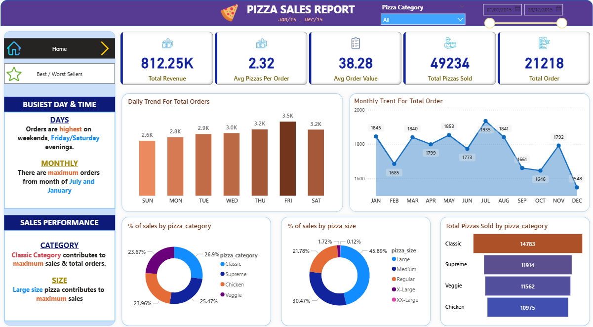

# 🍕 Pizza Sales Analytics Dashboard

### Power BI | SQL Server | Power Query | DAX

## 📋 Problem Statement
A pizza restaurant chain required data-driven insights to monitor sales performance, identify top and low-performing products, and analyze customer purchasing trends across different categories and time periods.

## 📊 Project Overview
Analyzed 48,000+ pizza sales records to extract key business KPIs, sales trends, and product performance insights using SQL Server and Power BI.

## 🛠️ Tools & Technologies
- MS SQL Server — Data storage and KPI queries
- Power BI Desktop — Dashboard development and visualization
- Power Query — Data cleaning and transformation
- DAX — Calculated measures and KPI creation

## 📌 Key Features
- KPI Analysis — Total Revenue, Average Order Value, Total Orders
- Daily and monthly sales trend analysis
- Sales breakdown by pizza category and size
- Best & Worst Sellers — Top 5 and Bottom 5 products
- Interactive dashboard with slicers and navigator buttons (2 pages)

## 📈 Business Questions Answered
- What is the total revenue and average order value?
- Which days and months generate the highest sales?
- Which pizza categories and sizes perform best?
- What are the Top 5 and Bottom 5 selling pizzas?

## 🔗 Dashboard Preview

## 📁 Project Files
- `SQLQuery1.sql` — SQL queries used for analysis
- `Pizza Sale.pbix` — Power BI dashboard file
- `pizza_sales.csv` — Raw dataset
